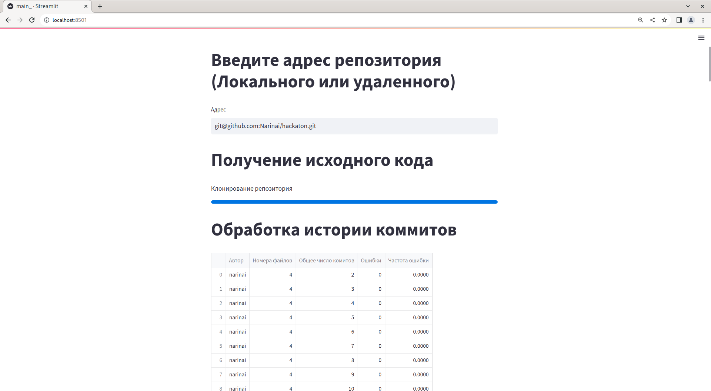

# Hackaton \</beCoder\> task
**The project that had been written by us in 32 hours as part of the Hackaton \</beCoder\> final**

The project analyze the repository and build graph that represents the ratio of commits with mistakes to total commit numbers

But, tbh, i sure you won't ever need this project

## Usage
1. Install requirements from [requirements file](requirements.txt)
2. Launch module

## License
This code is completely free and open-source and licensed under the [Apache 2.0](https://www.apache.org/licenses/LICENSE-2.0) license.